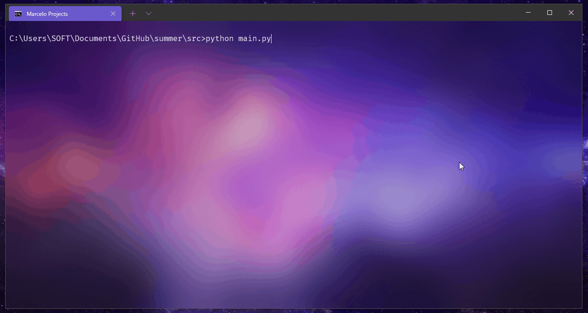

<h1 align="center">🧠📘 Summer ✍🤖</h1>

<p align="center">
    OpenAI GPT-3 script that summarizes complex text
</p>

<p align="center">
    
    
</p>

## 🎁 Features
* Summarize texts
* Configure the processing engine
* Export texts in a .txt file

## 🚀 Deployment
First you have to fill the `key` property of the `OPEN_AI_API.json`:
```json
{
  "key": ""
}
```

The `OPEN_AI_API.json` file will look like this:
```json
{
  "key": "sk-RBQqqKwCgYUqTxucxTLgZLbSbCckWLVhNxfxBCNH"
}
```

Then just execute the main file:
```bash
cd src/
python main.py
```


## 🔨 Builded with
### JSON
The script reads OpenAI API Key from a JSON file. So the software needs import json module.

### OpenAI
The official package of OpenAI that provides classes/methods like: `openai.Completion.create`.


## 🤲 Contributing
Do you would like to contribute? Do you want to be the author of a new feature? Awesome! please fork the repository and make changes as you like. [Pull requests](https://github.com/360macky/summer/pulls) are warmly welcome.


## 📃 License
Distributed under the MIT License.
See [`LICENSE`](./LICENSE) for more information.
